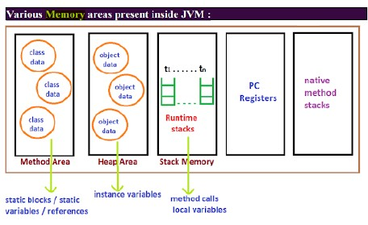
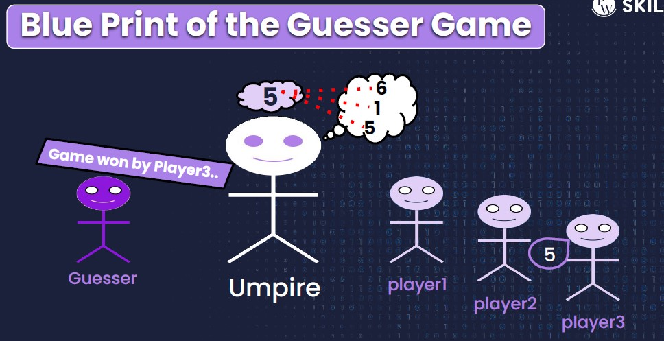

### Oops fundamentals
- [Object creation](lectures/1.ObjectCreation.pdf), [exercise](exercises/ObjectCreation.java)
- [Instance variable vs local variables](lectures/2.Instance-Localvariables.pdf)
- Methods with memory maps (JVM data areas)
 
  
  - Class level binary data including static variables will be stored in `method area`
  - Objects and corresponding instance variables will be stored in the `Heap area`. 
    - For every method the JVM will create a `Runtime stack`, 
    - All method calls performed by that Thread and corresponding local variables will be stored in that stack. 
    - Every entry in stack is called Stack Frame or Action Record
  - The instruction which has to execute next will be stored in the corresponding `PC Registers`.
  - Native method invocations will be stored in `native method stacks`. 
- [Method overloading](lectures/3.MethodOverloading-AutomaticePromotion.pdf), [exercise](exercises/MethodOverloading.java)
- [Automatic type promotion](lectures/3.MethodOverloading-AutomaticePromotion.pdf), [exercise](exercises/ObjectCreation.java)
### [Guessor game](exercises/LaunchGame.java)

### [Array](lectures/4.ArraysBasics.pdf)
- Why an array?
- What is an Array?
- How to create an array?
- 1d, 2d, 3d and regular jagged with memory
- Different ways to create an Array
- Buffer over run and arrayindexoutofbounds exception
- Disadvantages of Array in Java
### [Strings](lectures/1.OopsFundamental.pdf)
- String Introduction
- Types of String
- Immutable String and Memory Map( Constant Pool)
- Ways to compare
- Inbuilt methods in String class
- Concatenation
- Revering String Different cases
- Palindrome
- Anagram program
- Pangram program
- Mutable String
- String Buffer vs String Builder
- Inbuilt Methods
### [Static](lectures/1.OopsFundamental.pdf)
- Static keyword
- Class loading and How java program actually executes
- Different components in Java program
- Static variables, static methods, static block
- Differences w.r.t Non static and static members of a class
