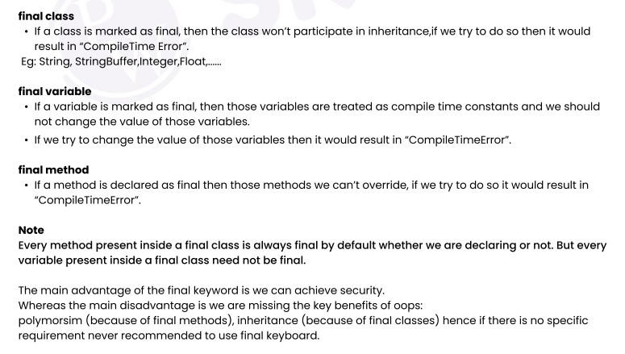

### [Encapsulation](lectures/1.Encapsulation.pdf)
- Need of Encapsulation
- What is Encapsulation?
- Private members
- [Shadowing problem and this keyword](lectures/2.Shadowing-this.pdf), [exercise1](exercises/SettingValuesOfProperties.java), [exercise2](exercises/InitialiseProperties.java)
- [Setters & Getters](lectures/3.Setters-getters.pdf), [exercise](exercises/SettersAndGetters.java)
### [Constructor](lectures/4.Constructor.pdf)
- Constructor, [exercise](exercises/ParametrisedConstructor.java)
- [Constructor Chaining (`this() vs super()`)](lectures/5.super-this.pdf), [exercise](exercises/SuperThis.java)
### [Inheritance](lectures/6.Inheritance.pdf)
- Inheritance intro
- `extends` keyword
- [Types of Inheritance](lectures/7.InheritanceTypes.pdf)
- Important key points (5 keypoints)
  - [Multiple Inheritance](exercises/Multiple_Inheritance.java), [Inheritance Human Example](exercises/InheritanceHumanExample.java)
  - [Inheritance example to implement parent class method](exercises/InheritanceImplementParentClassMethod.java), [Aeroplane Inheritance example](exercises/Aeroplane_Inheritance.java)
- Types of methods Inherited, overidden, specialized
- Rules to override method
- Constructor execution in case of Inheritance, [Constructor example with `this`](exercises/ConstructorExampleWithThis.java)
### [Polymorphism and Abstraction](lectures/8.Polymorphism.pdf)
- What is polymorphism?
- How to achieve polymorphism
  - Method Overriding
- Runtime vs Compile time polymorphism
- [Abstract keyword and Abstraction](lectures/9.Abstraction.pdf)
- Abstract class and Abstract method
- [OOPS assignment](lectures/11.OOPS-assignment.pdf)
### `final` keyword
- final class
- final variable
- final method

### Interface
- What is interface?
- Need of Interface
- Important key points of Interface
- Abstract vs interface
- Additional features of Interface
- Functional Interface
### [Lambda Expression](lectures/12.Lambda.pdf)
- What is Lambda Expression
- Different ways to create Lambda Expression
- Lambda Expression excercises
- [Functional Interfaces](lectures/13.FunctionalInterfaces.pdf)
### 
